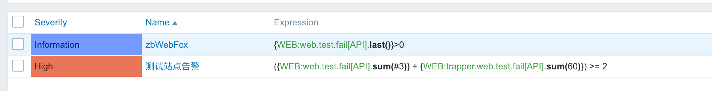
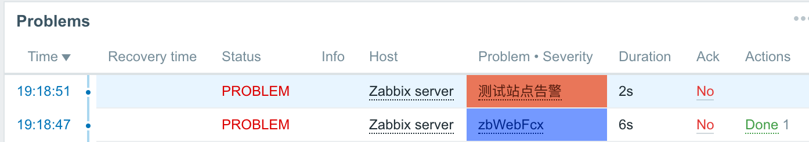
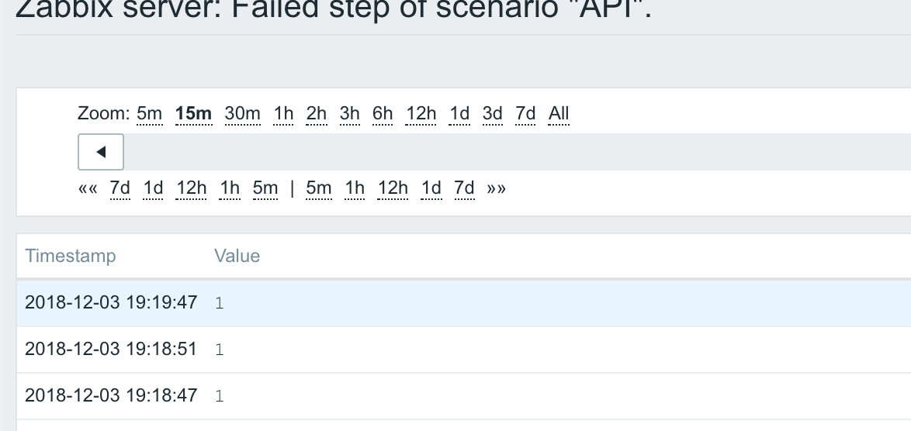

# zbWebFcX

> python版 WEB monitoring

Zabbix `Web monitoring`变频器


### 简介
> 2018中国Zabbix大会某大佬提到的变频器概念

- 采用`Web monitoring`监控站点为防止网络抖动，告警器配置一般为两次异常才触发报警。
- 这种防抖动配置方法有个弊端：故障发现时间为 `步骤时长 x 2`；假定一分钟监控一次，故障发现时间需要两分钟。
- 可用于`Web monitoring`告警动作，在第一次发现故障时，通过告警动作去触发。
- 触发后将结果存入数据库，这样故障发现时间为`步骤时长 x 1 + 站点访问返回时间`；假定一分钟监控一次，故障发现时间是一分钟加上站点返回时间。


传入`Zabbix Web monitoring`某个`itemID`，自动测试应用场景，并将结果发送到`Zabbix Server`。
### 配置
Action配置
```
{ITEM.ID}|{HOST.HOST1}|{ITEM.KEY1}
```
脚本配置
```
z.host			# zabbix主机
z.port			# zabbix主机port
CONFIG			# zabbix配置文件
```
其他
```
WEB监控所在服务器新增类型为Zabbix trapper的监控项

keyname:   trapper.web.test.fail[<webmonitorname>]
```



### 效果


触发第一次告警立马执行脚本，将请求结果返回给`ZabbixServer`
> 第二个触发器判断到条件满足，发出告警






### 说明

部分鸡肋功能没实现
- HTTP STEP `Query fields`功能
- HTTP STEP `Download speed`功能
- HTTP STEP 部分特殊错误返回没具体化


